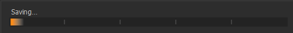

# Capture One : praise & some critical thoughts one year later

### Capture One : praise & some critical thoughts one year later

**I switched completely to Capture One from Lightroom about a year ago, after using Adobe software for many years. How has the change affected my photography and what do I think of the software?**

Note that if you haven’t read [my initial review or first impressions](http://weholt.org/2020/05/28/capture-one-a-review-of-sorts/), you’d better do that first :-). In that post, I explained how I loved Capture One for editing, but had some issues with the organizing side of things, felt there were too many bugs and that the solution had some serious performance issues. I still love it for editing, and I’ve found good ways of organizing my photos inside Capture One. The recent version 21 introduced dehaze and a few other functions that were nice additions as well. The same release also touted some improved performance, but that hasn’t impressed me that much in practice.

A year into using Capture One seriously, two things have become very clear;

1) this piece of software has radically changed how I view photography, and how I organize, edit and archive my photos, and

2) Capture One still has serious performance issues and bugs which makes me uncertain if I want to buy the next release. That doesn’t mean I’m not going to use Capture One anymore. I just won’t jump on the next release without testing it a bit more first. If the features and fixes in the next release aren’t worth the upgrade fee I’ll just keep on using Capture One 21.

**Using Capture One to organize my existing photo archive**

How I approached using Capture One for my existing photo archive is very different from how I use it for my new photos, which I will explain below, but many photographers will, like me, have an existing archive or collection of photos, and this is the main area where I feel Capture One needs to improve the most, ie. handling large amounts of photos. I’ve read online that people have a large collection of photos in Capture One, and it works just fine, but this is my experience.

When I bought Capture One I had grown tired of my non-performing solution of storing 350.000 photos in one single Lightroom catalog. And, I know, having such a large catalog and expect any kind of performance is stupid, but let me explain. Just a few days after my purchase of a full Capture One Pro license, Adobe released an update that made Lightroom way more responsive, but it was too late. I would soon discover that Lightroom not handling my photo catalog wasn’t my biggest problem. I’ve taken digital photographs since 2001, and since then I haven’t deleted a single photo. Not even the bad ones. Not the blurry, out-of-focus ones, nor those of my shoes or feet taken by accident. I’ve kept them all. That, and the fact that digital cameras can take a bunch of photos in just a few seconds, made my collection of images grow to an alarming size over the years. This was not fixed by switching to Capture One, and it’s clear that it’s not an actual software-related problem at all. It’s related to the guy behind the camera, the guy using the software.

Dealing with the massive amount of data alone gave me some serious challenges, and I had to do a lot of organizing, deleting duplicates, and dividing my photo collection into year-based groups before importing anything into Capture One. I solved this mainly by developing lots of specific Python scripts to sort the photos, move movies into separate folders structures, etc, but I kept on finding old folders on different external drives, forgotten memory cards, or other NAS (I have three Synology boxes) so the job of deleting duplicates and sorting photos took a few months actually.

My main take-away from this experience is to **keep one master folder structure**, which is kept up to date with all your files. This is the one you use as the base for your backup process. Having multiple backups is nice, and a good idea as well, but everything should be a copy from your master. Early on I thought it would be a good idea to create multiple copies, stored on different external drives, but somewhere I lost track of what was the master and spent several weeks getting a complete overview of all my backups, re-building my master folder. This is now stored on my main NAS, copied onto a second NAS using rsync for local backup, and copied to a cloud service as well.

As I imported photos into Capture One catalogs the software seemed to run slower and slower as the number of images grew. I quickly found out that I had to use a pretty fast SSD to get any kind of acceptable performance, but even on a very fast SSD, there seem to a significant slow down when the catalog passed about 20.000 photos. Navigating the catalog after the import was sluggish as well. I tried using sessions, but they behaved even worse, and this has also been said by Capture One themselves, that sessions are not meant to handle large amounts of photos. So I created catalogs for all photos in a given year, but only to get an overview, before grouping the photos into logical and/or event-based albums, which are then exported into sessions. This is one area where Capture One could be improved easily, by having a function to create a new session based on an album or selection, optionally moving the related photos into the new session, and deleting them from the catalog at the same time, all without having to close the catalog I’m working in. If you’re in a catalog you can export to another catalog, but not a session. Strange. My work-around for this has been to create a new session and check the “Open in new window” box, which makes it possible to keep the original session or catalog open as well. It solves the problem of constantly creating, and re-opening sessions or catalogs when splitting photos into different sessions, which was my method for a while, but I still think Capture One should have this feature built-in.

So, if you already got a large photo collection and want to organize it using Capture One:

Use fast SSD for storageDelete all duplicates using software like [DupeGuru](https://dupeguru.voltaicideas.net/)**before** importing anythingUse catalogs, not sessionsMatch the generated preview size to your screen resolution, it may speed up the generation of photo previewsIf possible, split your collection into logical groups, like per-year, etc, before importing those photos into a temporary catalog, cull those photos, and re-import the remaining photos into the main catalog to get the best experienceRemove any movies from your photo collection. Capture One, like Lightroom, is not very good at handling movies, and I experienced lots of problems with sluggish performance in my catalog or session, only to discover that it was a movie file causing the problems**Using Capture One into the future and how this piece of software changed my view on photography**

Capture One has a similar concept of catalogs as Lightroom, but it also has a slimmed-down, a more portable solution called sessions, which has been my go-to way of organizing photos; I create a new session per date, event or occasion, cull, rate, and organize, then edit, often doing a second run of culling and rating after editing the photos who survived the first culling. When you create a session it will have four folders inside it by default; Capture (where your imported photos go initially), Selects (where your best photos go), Output (where your finished edited photos are exported to as JPEGs or TIFFs, etc), and Trash. An important point here is the Selects folder. I went from keeping everything, to actively looking for my selects, deleting all the trash, often reducing my sessions size from many thousand photos initially, to just a few hundred, and even less when done. And of those keepers, just a few got put in the Selects folder.

When I feel I worked through the session, picked my selects, and moved those to the selects folder, I import those selected photos into a separate session for all the best photos from the related year. This process helps me focus on finding my best photos, by refining the selection over a few steps, while archiving good and relevant photos in an organized way as well. I may have to refine and adjust my method of organizing later, because lots of other photographers may argue that it is the Output folder that contains the real gold. And if I did much exporting to TIFFS with subsequent retouching that might be correct, but for now I’d rather keep my RAW file, with its adjustments and metadata in my Selects folder, and find another way to handle the Output folder.

The bottom line is that using Capture One for a period of time has also affected how I evaluate my photography. I’m more mindful when I’m out shooting, thinking more about getting something worthwhile, something worthy of the Selects folder. It has given me a higher standard for my photography, and even if I might overshoot at times, I know that I have to process the photos properly when I get back home, constantly look for my best photos, and get rid of the rest, ending up with just the best — in my Selects folder. I could easily achieve something similar using Lightroom or some other piece of software, but the default folder structure of a session, that lovely folder called Selects, really was an eye-opener.

**Performance — or lack thereof**

When you keep your catalogs and sessions small and tidy, Capture One behaves excellently. At least until you want to switch to a different session or catalog. Then you’ll experience the nice eternal “Saving ….”-dialog from time to time.

This seems to happen if you’ve worked for a while in Capture One without restarting it or worked in large catalogs or sessions for a while, but I’ve had this problem after starting Capture One and just loading a different session as well. The only option is to kill the program.

And if you’re adventurous, crazy, or just have a lot of photos you need to import and organize, Capture One frequently freezes, thumbnails won’t render in the browser panel, strange movement and realigning of the Capture One window, etc.

There also seem to be some memory leaks in the program, because quite often if I do some process over and over, like creating a catalog, importing a lot of photos, creating a session (and entering the session), only to close the session again by opening the catalog to export a collection into the mentioned session, after a few steps like these, the program exits abruptly with a dialog explaining the unexpected goodbye. Another issue I experienced was when I was exporting a lot of photos from albums the export process took longer and longer to finish. After a while, it spent several seconds exporting just one photo, when it took two or three in a second, to begin with. A restart made the export process snappy again, but this is also a symptom of something building up in the software making it slower when used for a longer period.

Other times, after a frustrating amount of irritating behavior, the program suddenly gets more responsive again, like it just had to process something in the background, even if the Activities window shows no background process running. I haven’t found any pattern other than an increase in strangeness as the number of photos in a session or catalog gets higher. So for now, to have a good experience using Capture One, keep your image count as low as possible.

My computer is just a few years old as well, sporting a still blazing fast AMD Ryzen 7 1700 CPU at 3Ghz, 32GB of memory, fast SSD drives for storage, and an NVIDIA 1070 GPU. This should be more than enough to run software like Capture One, and even if I’ve grown used to buggy software related to video and photo editing, the performance hiccups and amount of bugs in Capture One in situations like the ones described above, are just very annoying.

**The futile exercise in bug reporting**

And in the beginning, as a new Capture One user, I reported most of my crashes and problems using the built-in report tool in Capture One, but I’ve never gotten any kind of response. The only thing I’ve used that really worked was using the report page on the support pages, and even though I found the response time a bit on the slow side, it was generally a good experience.

I’ve also tried to send in plug-in requests using the supplied method on the support pages at phaseone.com, but this resulted in a “550 Invalid recipient” error.

It’s hard to be a “good citizen” when the provided method of reporting problems doesn’t seem to work at all or getting an answer from the official support team takes days.

**Obvious feature improvements**

A few things I think Capture One really should come with out of the box which is missing right now are:

HDR — option to merge photos, either merge stacks of images or merge images into larger compositesStacking — put photos taken in a given interval span into groups. I’ve made a small Python-script that tags photos taken in a given interval, like a 5-sec span, and adds a generated metadata keyword to it so I can filter photos by that tag later, but this fills up my list of keywords, and it’s not an elegant solution. This is a very helpful feature to cull sporting events or even portrait shoots if you have lots of photos taken in bursts.**In conclusion**

I love using Capture One! For general editing of my photos, I can see a real improvement in quality from what I got when editing my photos in Lightroom compared to Capture One. The editing tools are great to use, intuitive, and I feel like I’m developing photos, not digital art.

Capture One has great support for Fuifjilms film simulations, and even if it doesn’t look 100% like the ones in-camera, it’s close enough to be a base for further work.

The only thing I notice is that my older files, from cameras like the Panasonic GH5, don’t look as good as they did in Lightroom. They look pale and dull, and I feel like I got better results for those specific files in Lightroom, but that might change as I work my way through my photo archive and get more time editing those files. So far I’ve mainly worked with my Fuji and Sony files, which looks awesome!

As long as I keep my sessions small the performance in Capture One is also good, at least after the initial generation of previews are done.

Perhaps the most important thing the change to Capture One has taught me is the importance of reducing my collection of photos, both by the focus on Selects, to remove all trash and only keep good images, and by forcing me to keep my collections small and tidy to get a good experience using the software. And even if the last bit is due to Capture One’s inability to handle large amounts of photos, it has made me more focused in the culling process.

Other things I just love:

Layers and masksColor editorThe EIP file formatProcess recipesThe image qualityThe communityThe youtube videos*Originally published at *[*http://weholt.org*](http://weholt.org/2021/02/23/capture-one-praise-some-critical-thoughts-one-year-later/)*.*
