# Optyx : faster culling with fancy AI?

### Optyx : faster culling with fancy AI?

I do all my culling and post-processing in Capture One Pro 21. Or, at least, I want to, but a few missing features in Capture One makes me look into other software solutions to speed up my culling process. The idea is that if I can cull fast, reduce the number of files to import into Capture One, I will save time in the long run. Performance in Capture One is, at least in my experience, very IO-dependant and seemingly does some strange re-scanning of files when filtering content, which in turn makes everything very sluggish if the Capture One session contains lots of photos. So less into Capture One = a better overall experience.

First of all, Capture One doesn’t have a grouping feature similar to Lightroom, where photos taken within the same time interval are grouped. This is very handy for people like me who overshoot a lot, especially when photographing sports. My trusty Fujifilm X-T3 can take up to 30 shots per second in a single burst, but most of the time I only want to keep one of these shots. A few minutes later, I have another burst, then another, and at the end of the day, I have many photos, most of the time, several thousand images, to cull through. If all of these photos were grouped according to the burst, scrolling through those photos, keep one, delete the rest, next group, etc, this would really speed up my culling process. In Capture One, this is not possible as of version 21.

Secondly, I’m organizing my photo collection dating way back to 2001, which in total has somewhere around 350.000–450.000 thousand images. Crazy I know, but I didn’t delete anything until last year, so I have a lot of photos to process. The grouping function described above would help out a lot in this process as well, but also features like automatically finding the photo with the best focus and rating it accordingly, and other AI-driven features could make the whole culling process less tedious.

There are several solutions for these problems, like [Optyx](https://www.optyx.app/)which is the topic for this post. [Narrative Select](https://narrative.so/select) is another option with similar features, but that’s only available for macOS :-/. Another alternative I’ll consider is [FastRawViewer](https://www.fastrawviewer.com/), which I actually bought a few years back but haven’t used much since. It doesn’t have any of the fancy AI features, no grouping feature, but it’s fast and has focus peaking and a few other nice tools. After doing all my testing of Optyx, I also found an app called [Aftershoot](https://aftershoot.com/), but I haven’t tested it yet ( [but this dude has](https://www.youtube.com/watch?v=g2JqNoZZkkk) 🙂 ).

My plan was initially to cull the images before importing them into Capture One, but that involves more steps in my workflow. Capture One can also detect changes done outside of Capture One to photos stored in a Capture One Session so hopefully, any solution will update metadata stored in sidecar XMP files in a way compatible with Capture One, so I can import photos using Capture One as before.

**Notes on hardware**

Capture One is very IO-intensive so a fast hard drive is essential. For smaller sessions, I’m using my system drive, a very fast M.2 SSD, but because of the size of my test data, most of my testing was done with a slower SSD. Usually, my culling process will involve just a few thousand photos, but because I need to cull my existing photo collection as well, I need to test any software using large amounts of data, including several different types of RAW files from different camera models. My tests were performed on the following hardware:

AMD Ryzen 7 1700 Eight-Core Processor 3.00 GHz CPUMemory : RAM 32,0 GBNVidia GTX 1050TiWindows 10 ProVersjon 20H2Windows Feature Experience Pack 120.2212.551.0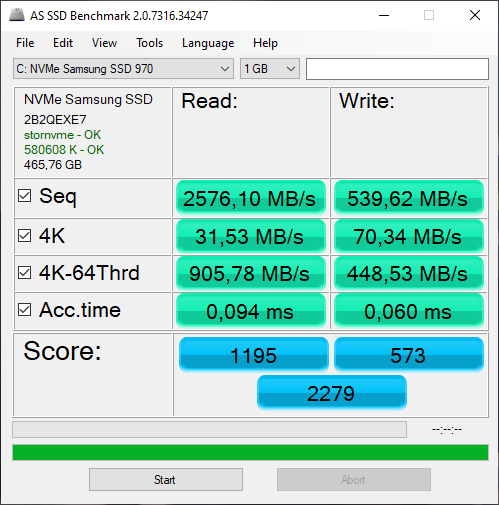

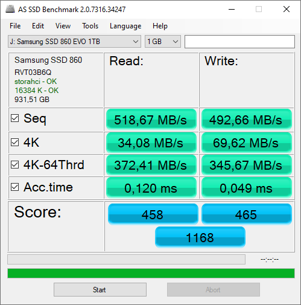

**Gathering test data**

To collect my test data I wrote a python script that scanned through my photo collection and copied up to 2000 RAW files of each type (raf, nef, arw, etc). The test data consisted of 14951 files from different cameras, a drone, and a mobile phone, mostly RAW files, but some JPEGs as well, for a total of 338 GB of data. The following cameras were represented:

Nikon D70Panasonic GM1Panasonc G7Panasonic GH5Sony ILCE-7M3 / A7IIISony ILCE-7M2 / A7IIDJI FC220 / Mavic ProSamsung SM-G960F / Galaxy 20Fujifilm X-T30Fujifilm X100sFujifilm X-T3Fujifilm X100FFujifilm X-Pro 2**Culling test data from my photo archive**

I Started Optyx, created a new shoot, then dropping all the files into the app. It took about 50–60 seconds from I dropped the files until I got the choice to proceed with the import.

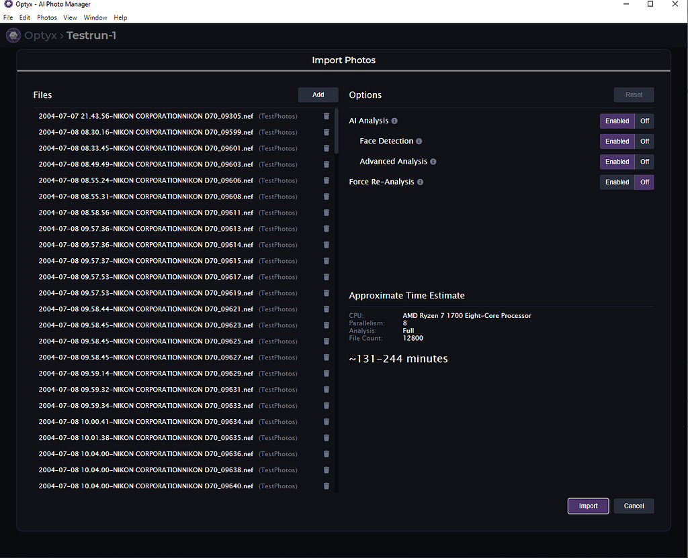

Of my 14951 files, Optyx only imported 12800. What files it ignored is unclear. Some sort of log would help out a lot, or a message box explaining that not all files can be imported, and perhaps why.

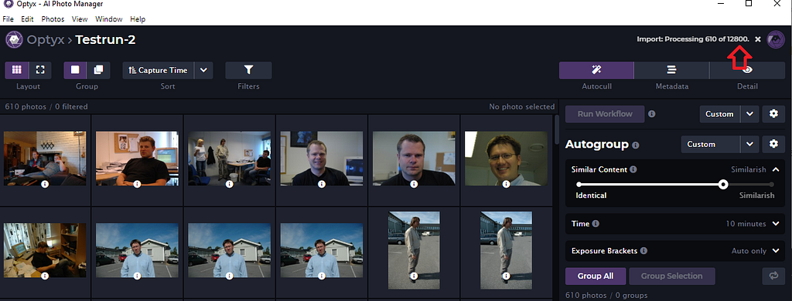

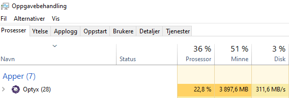

I got some errors during import/processing related to images from my Samsung mobile phone, but they disappeared before I can take a screenshot, and I didn’t find any log related to those errors after the import. The process took about 38 minutes, then the analyzing part began. The analysis took about 2 hours and 22 minutes. The entire process took exactly 3 hours to complete.

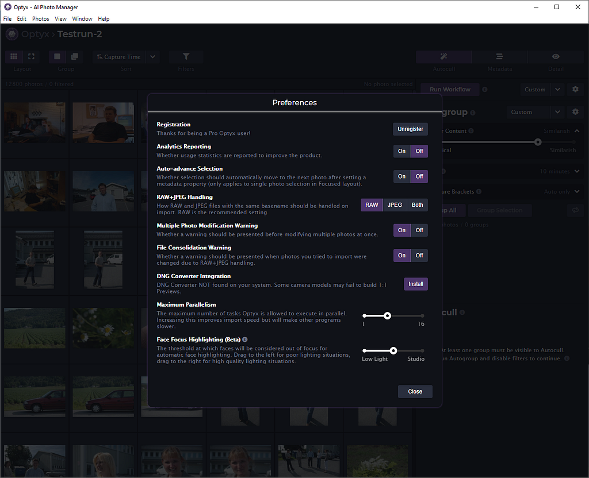

After the import & analysis, I saw that RAW+JPEG handling was set to just import RAW, which might be the reason it only imported 12800 files. I didn’t have a DNG converter installed either, which might have affected the process.

I installed the Adobe DNG converter, changed Maximum Parallelism to 16, set RAW+JPEG handling to Both, closed Optyx, and ran the whole thing again, which led to 12950 files being imported. CPU usage increased from about 25–30% to around 35–40%, and used about 10–11GB of RAM, compared to 3–4GB RAM with the previous settings.

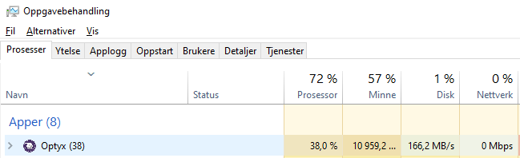

As the analyze-part started over, now with more threads running, the CPU consumption really increased:

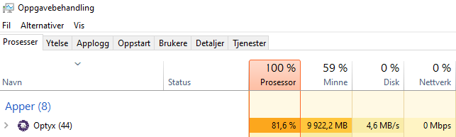

After those changes, processing 150 more images, the whole thing finished after approx. 2 hours and 50 minutes.

Then I grouped all the photos, and started the Auto Culling, which ran for almost an hour, using little CPU and harddrive resources:

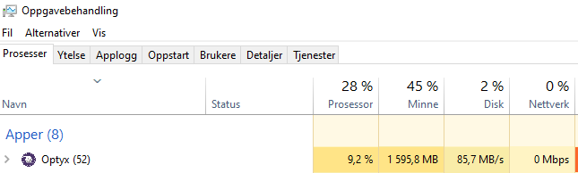

The result was a bunch of photos rated 3 if ok and 4 if good. At first glance, it seemed to do an ok job. The following two photos were grouped, the first with no rating, and the second one rated 4. The latest one is clearly also the only one with proper focus, — so nice job so far.

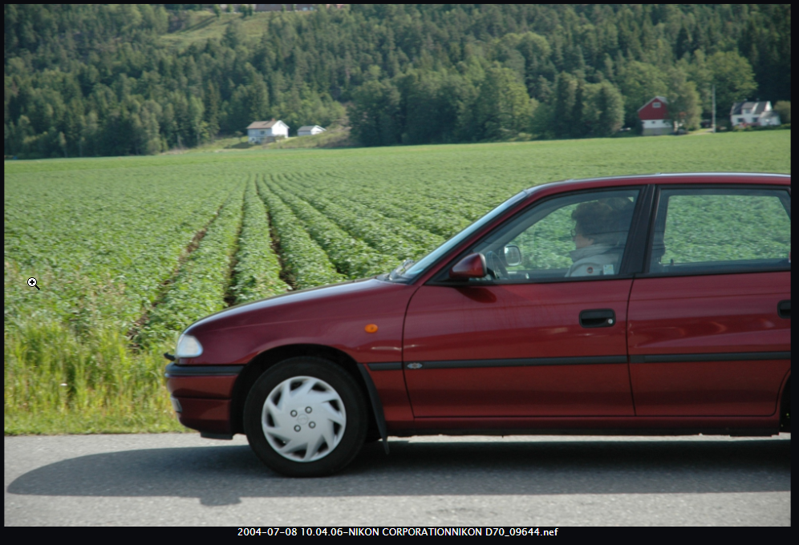

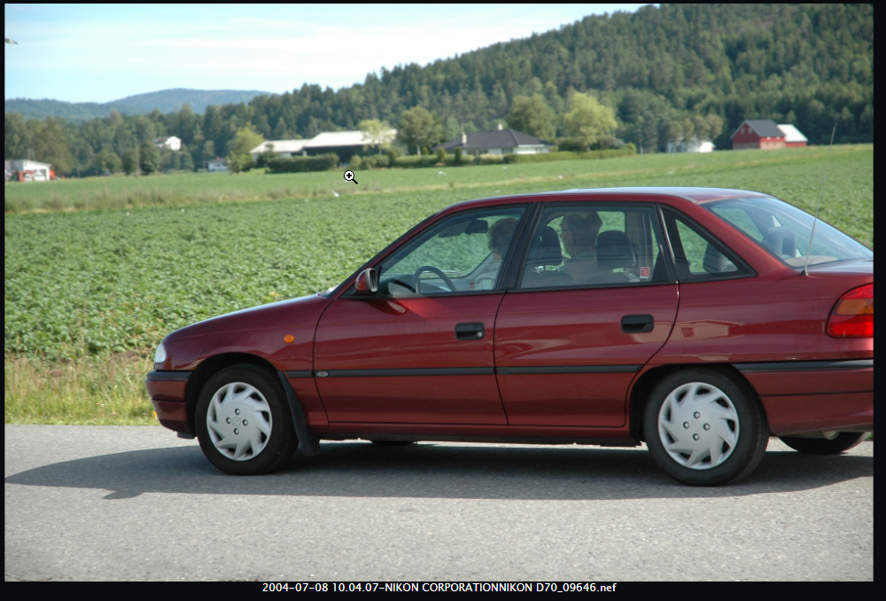

One way I could see being helpful would be to let Optyx process a large set of photos, apply ratings according to my own Optyx-related Workflow, then import all the images and XMP sidecar files into Capture One. That could give me a better starting point having all the files already rated according to focus etc, but the time spent using Optyx could just as well be spent just starting culling in Capture One, and so far I cannot see the big time saver here, not as long as I still have to go through and look at each photo. And even if Optyx could mark the photos with the best focus, Capture One has a focus mask which could also help me with that.

Another problem I discovered was that when I started Optyx a few days later and tried to open my shoot containing all my test data, which I’d already spent about 4 hours working on (initial import and analyzing took 3 hours, 1 hour spent culling photos), it just would not load. It seemed to go into an endless loop, starting different processes (according to the task manager), then stopping them, with flickering windows opening and closing. Tried opening several times, killing all Optyx-related processes before each attempt, but the same just happened over and over. Not very confident in the stability of the software after this. I’m used to instability, sluggishness, and strange behavior in photo and video-related software when processing a large amount of data, but adding more software with the same problem I’m trying to solve in my initial piece of software won’t help at all.

**General observations**

Optyx seems snappy as hell! Previews are quick to render and scrolling is fast as well.I wish I could have support for two monitors, with my grid on one, and detail view on the other, or at least have a bigger detail view while having the detail view active.Optyx is good to detect which photo is in focus, but any blur created with artistic effect is ignored — so be careful if you’re inclined to use blur with intention.I wish I could see detail from several photos at once. I can see Optyx has determined that one is more in focus than another, but it would be nice to have these side by side and compare them in a detailed view.Optyx doesn’t have any opinion of composition and/or exposure of course and will rate a photo slightly more in focus with bad composition/exposure higher over a photo with less focus but with better composition/exposure.The photos shown in the left side panel while in detail view don’t align with the one I selected from the grid view. Shown below.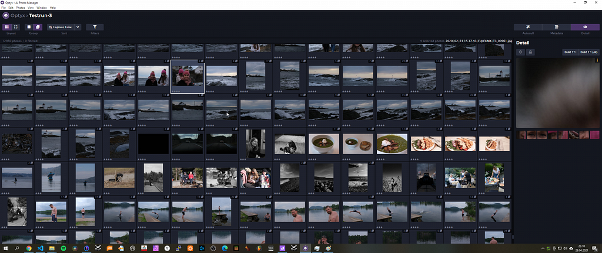

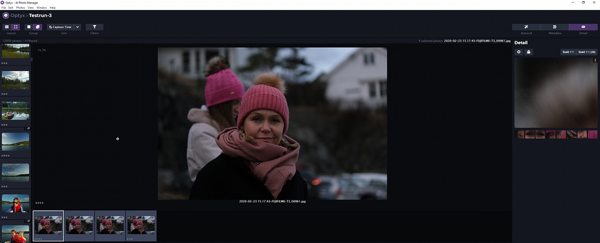

**In conclusion (so far)**

How much better is my workflow using AI-driven software automatically culling my photos, compared to a dream-version of Capture One with a group by time interval feature? So far — not much. I still have to go through each group of photos because AI does not understand good composition, and my emotional response to the photos cannot be determined by a machine, at least not yet. Can it find out of focus images, yes, but sometimes, lack of focus is not what makes or breaks an image for me. Another thing is that it’s quite time-consuming processing a large set of photos, and if I have to go through them manually in the end anyway, there’s not much to gain time-wise compared to just importing the photos into Capture One.

I still like the idea of Optyx, it has a lot of great features and will keep my eyes on the project, but for now, I’ll continue to cull photos using Capture One Pro 21. I will test Aftershoot as well, sometime in the future :-).

**Epilogue**

Finally, I tested my own solution of grouping photos in a python-script and adding photos to generically named groups, added to an XMP file created in the process. The actual scanning of the files to about 6 minutes. Then I imported the files into a catalog in Capture One Pro 21, which took about 11 minutes. At that point, I had my files grouped by shooting interval and could start the culling, manually, which I ended up doing trying the AI-based approach anyway.

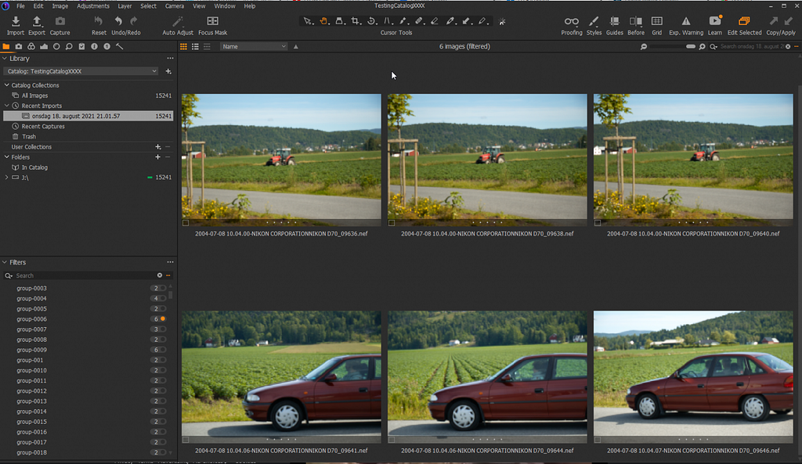

It’s not the most elegant solution, and it requires some cleaning up afterward, like deleting the group tags generated by the script, but that takes seconds, a minute at the most.

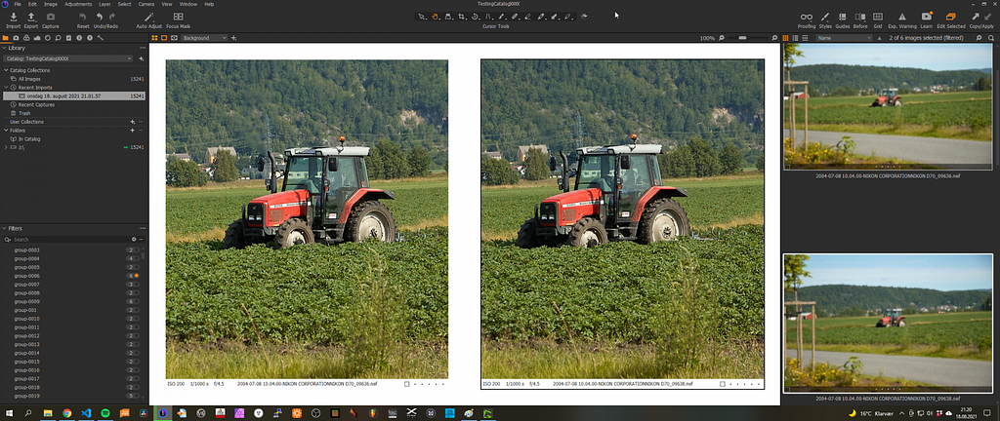

I can view two or more photos side by side to see which I like best, something I didn’t find a way to do in Optyx. The python script is part of a bigger photo/image-related project I’m working on, and it will be released as open-source after a bit more testing, code clean-up, and when I get the time to write some documentation.

**Further reading**

[This A.I. Culls Photos For You — And It’s Not Half Bad: Optyx Review](https://www.thephoblographer.com/2021/06/07/optyx-review/)[Ai Photo Management & Culling in Lightroom with Optyx](https://www.youtube.com/watch?v=XUL6hC7HQ7k)An alternative to Optyx — [Ai Photo Culling with AfterShoot](https://www.youtube.com/watch?v=g2JqNoZZkkk)*Originally published at *[*http://weholt.org*](http://weholt.org/2021/08/23/optyx-faster-culling-with-fancy-ai/)*.*
