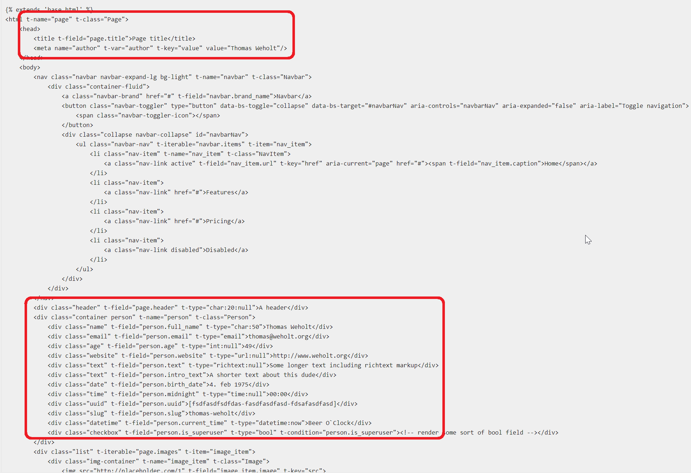
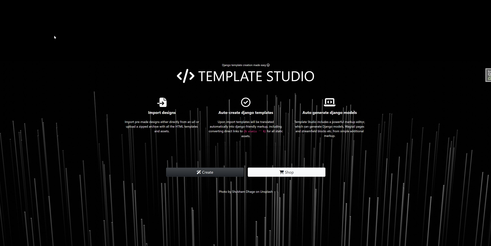
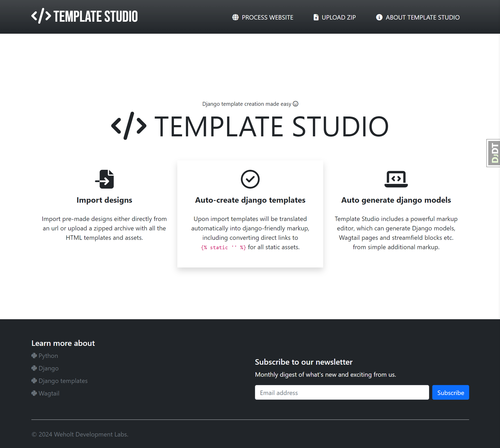
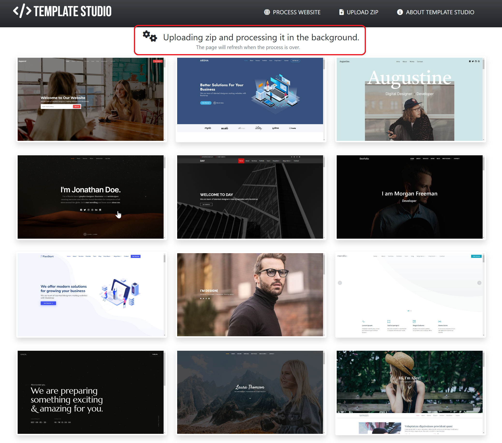
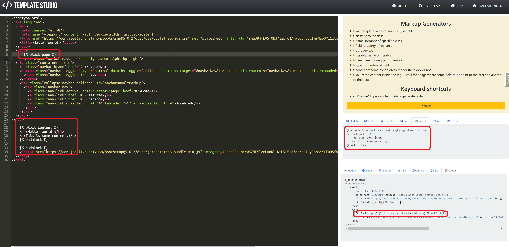
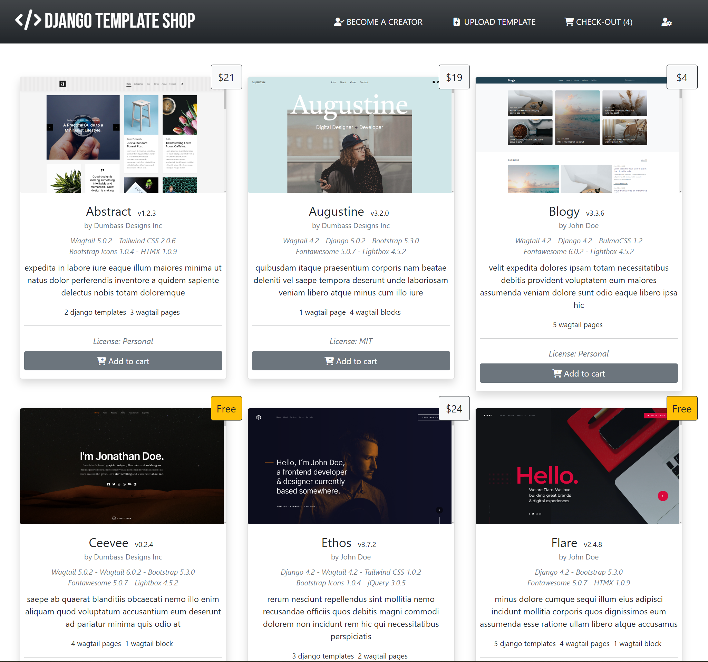

{: class="profile-img" }

# About me

Hi! I'm Thomas Augestad Weholt; an avid Python coder, free software enthusiast, hobby photographer, father of two & husbond of one. I've lived in Norway for about half a century. 

Got my first computer at the age of 12, a Commodore 64, leveled up to an Amiga 500 after a few years, and bought my first PC in 1993. Started programming in 1994. I've been working in tech since 1999, as a programmer since 2000. My dayjob is developing WFM systems at Visma, one of Norway's biggest tech companies, and I've been doing that since about 2001. 

I'm what you call `a stayer`. You can contact me at thomas@weholt.org.

# Professional experience

This site is about my private, free software projects, so just lets get this out of the way. 

Professionally, I've been using these technologies (my own assesment of expertise in paranthesis, 1 being crap, 5 being great):

- Borland Delphi (2)
- Microsoft SQL Server (4)
- Javascript (3)
- C# (4-5)

The project I've been working on for over 20 years now is a on-premise, enterprise solution, and I've been mostly doing backend work, with some frontend stuff sprinkled in. Being color blind I got kept from the frontend after a while because my colors were always a bit off ;-).

# Free software

I got into Linux in 1996, and the free software idea really resonated with me. A student at my college (HiT, Bø - Telemark) showed me Perl and I bought every book about that programming language. He also mentioned Python, which he said would be a better fit for me, but I was determined that Perl was my way into open source and free sofware. After struggling with Perl for a few months, and got cursed at by a core Perl developer at the time, I went back to that student and asked more about Python. He showed me some examples and sent me a link to the official Python documentation. After 30 minutes I was hooked. I sold all my Perl books, and since that day coding in Python has been my favorite past time activity.

After a few years I came across Django. It was still pre-1.0 release, think it was pre-0.83 or something, and once again it was the documentation that got my attention. Django has always had great docs, and it was easy to get projects up and going. Back then some of the core Django developers was active on usergroups etc, and I had an interesting exchange with Jacob Kaplan-Moss, the creator of Django, about licenses. More on that later. But since then, nearly every project I make is using the Django framework. 

# Python - The Love Affair

Ok, so I love Python. No, really. I. Love. Programming. In. Python. As mentioned, I use C# at work, which is OK, and I would probably not recommend using Python for everything anyway, but my dreamjob, even though my current dayjob is really great, the dream would be to develop code to help projects like Django, Wagtail CMS, and Python in general, without any consern of what generates money. Just because I love Python so much.

So why is this feeling so strong for a friggin' programming language? Beside the mentioned documentation of Python itself, syntax and readability of the language, or the amount of third-party packages available, the main thing making it so great is that it's the language with shortest distance between idea and working code. That's the big one.

Although I've programming for all these years, very little has been published or actually used. It was all done for my own amusment. The only things I've released that had some use are:

### DSE - Simplified "bulk" insert/update/delete for Django.

[PyPi](https://pypi.org/project/dse/)

A bulk insert/update/delete package for Django 1.x back in 2011 when it didn't have one of its own. First release was May 8, 2014 and the final relase was Jul 15, 2010. The bitbucket repo is no longer available. This package was actually used by a lot of people, to transfer bank accounts as one example (probably bank account information, not the money itself). It was later replaced by the strangly named [massiviu](https://pypi.org/project/massiviu/), a major refactoring, mostly total re-write of the original project. It got its latest commit in Jan 21, 2017, is no longer maintained or used, and has now been removed from github all together. DSE was probably my biggest claim to fame so far in the open source universe.

Tech used:

- Python

### SerpentariumCore

[GitHub](https://github.com/weholt/SerpentariumCore)

Serpentarium Core is a basic service container for python using the typing Protocol to define interfaces and type hints to resolve construction requirements for services. This is probably one of the projects as of late that has inspired me the most. 

Thanks to ChatGPT for the project name ;-)

> What is the Service Container pattern?

> The Service Container pattern is a design pattern that provides a centralized location for managing application services. A service is a class or module that provides a specific functionality, such as authentication, database access, or email sending. By separating services from components, we can achieve greater separation of concerns and better maintainability of our codebase.

> The Service Container pattern works by registering services with a central container, which can then be accessed by components as needed. This allows us to easily swap out services, add new services, or modify existing services without needing to modify individual components.

> [Source](https://dev.to/abdelrahmanallam/simplifying-dependency-injection-with-the-service-container-pattern-in-reactjs-and-ruby-on-rails-525m)

Basic use:

```python

from serpentariumcore import ServiceContainer


class TheTalkingProtocol(Protocol):
    def speak(self, sentence) -> str: ...


class Teacher:
    def speak(self, sentence) -> str:
        return f"The teacher screams '{sentence}'."


ServiceContainer().register(TheTalkingProtocol, Teacher())

if person := ServiceContainer().resolve(TheTalkingProtocol):
    assert person.speak(sentence="The dog sits on a mat") ==
        "The teacher screams 'The dog sits on a mat'."
```

Tech used:

- Python version 3.12.2

### Airgun Performance Index - Website for airgunners

The now defunct airguntuningrecipes.com, later called airgunperformanceindex.com, was a site for tuning tips and tricks for high-power airguns, like the FX Impact M3. It had some traction and gained a little momentum for a while, but as my interest and ability to maintain the site faded, there was no interest to pick it up or fund the hosting of the site. I get likes daily on the [facebook page for the project](https://www.facebook.com/profile.php?id=100083540313721) and it now has over 3100+ followers. 

Tech used:

- Python
- Django
- SQLite for database
- Nginx as proxy
- HTMX for UI-trickery
- Docker for deployment
- DigitalOcean as hosting platform

### Django Suggestion Box


[Github](https://github.com/weholt/django-suggestion-box)

A reusable django app for managing suggestions from authenticated users, included up and down vote for suggestions.

Tech used:

- Python
- Django
- HTMX for UI-trickery

### Django Magic Link

[Github](https://github.com/weholt/django-magic-link)

A reusable django app for authenticating users by their email address. This is a slightly refactored version of [this](https://www.photondesigner.com/articles/email-sign-in).

Tech used:

- Python
- Django

### Wagtail Image Captions


[GitHub](https://github.com/weholt/wagtailimagecaptions)

This is a fork of the [wagtailimagecaptions](https://github.com/newshour/wagtailimagecaptions) repo to add support for EXIF metadata like camera make & model, aperture, shutter speed and iso rating. If present, GPS data will be processed as well, and latitude and longitude willl be stored on the new model CaptionExifImage.

Tech used:

- Python
- Django
- Wagtail

### Wagtail Image Uploader

[GitHub](https://github.com/weholt/wagtail-image-uploader)

Wagtail Image Uploader is a small package to provide an easy to use API for uploading images to one or more Wagtail sites in code. It is has two main components; a django view accepting uploads and a command-line client called wiuc making the uploads.

*Features*

- Single entry point for uploading images, protected by a long-ass access key generated for each user.
- Handy command line tool for uploading several images to several sites in one process.

```bash

$ wiuc -i test.png --verbose
********************************************************************************

                    Wagtail Image Upload Client v.0.1.0

********************************************************************************
Using .image_uploader.toml.
Preparing to upload 1 files (2.1MiB) to 1 sites.
Defaults: {'name': 'John'}
Pre-processors: ['JsonPreProcessor']
Uploading to default @ http://localhost:8000/upload-image.

DEBUG:UploadClient for http://localhost:8000/upload-image initialized with API-key.
DEBUG:Starting new HTTP connection (1): localhost:8000
DEBUG:http://localhost:8000 "POST /upload-image HTTP/1.1" 201 229
DEBUG:(Success:True) Uploaded test.png. Result: {'succes': True, 'processors': ... })
```

Doing it all in code is pretty easy as well:

```python
from image_uploader.client import UploadClient

url="http://localhost:8000/upload-image"
api_key="U0n7bUrr1J98npj2SBo6XHmpsK5j8VlHZu3fO1FYpLIxsiWLo1SEwugRI4XjfAvbxUXMcx1khWvyf0shTAAu19OmMIyMAV74fvWexm7cCAv0rxZWuBdZrGxfShMtPfeh"

client = UploadClient(api_key=api_key, url=url, verbose=True)
client.upload_files(*['test.png'])
```

Tech used:

- Python version 3.12.2
- Django version 5.0.2
- Wagtail version 6.0.1

### Wagtail Demo Provider

[GitHub](https://github.com/weholt/wagtail-demo-provider)

DemoProvider is a reusable Wagtail app for getting random stock images from online providers such as Unsplash and local images into your Wagtail site with ease. This is especially helpful for demonstration purposes or during development.


*Features*

- Management command for downloading stock images from image providers (currently only unsplash) for local use.
- Management command for adding local lots of images as Wagtail images.
- A demo-provider concept to easily make each app have a consistent way of adding demonstration data.
- A few helper-methods to add an local image to a Django Imagefield or as a Wagtail image in code.

Tech used:

- Python version 3.12.2
- Django version 5.0.2
- Wagtail version 6.0.1

### Django Sveve API

[GitHub](https://github.com/weholt/django-sveve)

A reusable django app for sending SMS using [Sveve.no](https://Sveve.no)'s API.

*Features*

- It can send SMS to multiple recipients.
- You can define groups of contacts and send a SMS to several groups at a time.
- Contacts can be imported from a spreadsheet/Excel/CSV file.
- Contacts can be synchronized with other sources by implementing a custom contacts provider, documented below.


Tech used:

- Python
- Django

### Projects under development

These projects are things I'm working on when I have the time and/or energy. 

#### SOML - Simple Object Markup Language



This is a project with two goals:

- Create a collection of attributes to use in a HTML document, which are parsed into a JSON Schema-compliant object, which in turn can be used to generate code like Django models and forms, Wagtail pages & snippets, python dataclasses or Pydantic models.
- Take the attributes used in the HTML document and transform the markup to django templates capable of using the structure in the JSON Schema generated above.

Tech used:

- Python 3.12 with focus on type hinting
- Pytest for a massive amount of unittests
- JSON Schema

This will in turn be used in the next project:

#### Django Template Studio

The lack of a good source for django templates has been a pet peeve of mine for a long time. This is an attempt to remedy that. This will work as a tool, similar to VS Code, as it won't be deployed to a server, but run on in a docker container on your local machine. It will hopefully make it easier to take a pre-made HTML design and convert it into something usable in django in a short amount of time.

The following is a few mockup of a possible design: 






This is in it's infancy and rely heavily on SOML so I have no idea when this will get released. This project will hopefully make the next project possible:

Tech used:

- Python 3.12 with focus on type hinting
- Django
- JSON Schema
- HTMX
- Docker for local deployment

#### Django Template Shop

A marketplace for django developers and designers alike to provide, either for free or at a price, django compatible templates, with or without code like models, forms etc as well, generated by Django Template Studio.



The image above is a mockup of what this could look like. 


